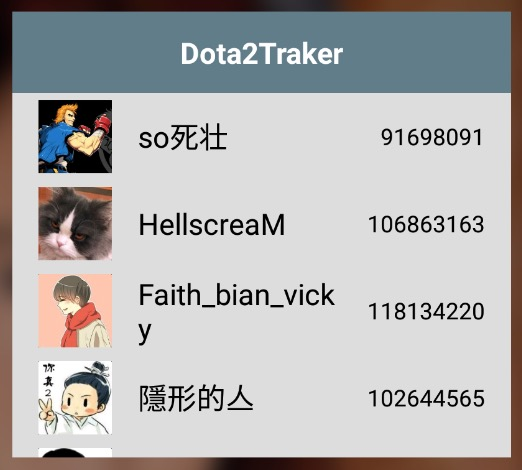

# Dota2Traker
An android app to follow dota2 players' match history. API from steam dota2.
How To Use
----------
You have to get a dev key from [Steam Api key](http://steamcommunity.com/dev/apikey) and set it in **gradle.properties** file.  

dota2 player ids to test:  
* 106863163  
* 129585121

Screenshots
-----------
phone:   

             
tablet:   
   
widget:   
   

